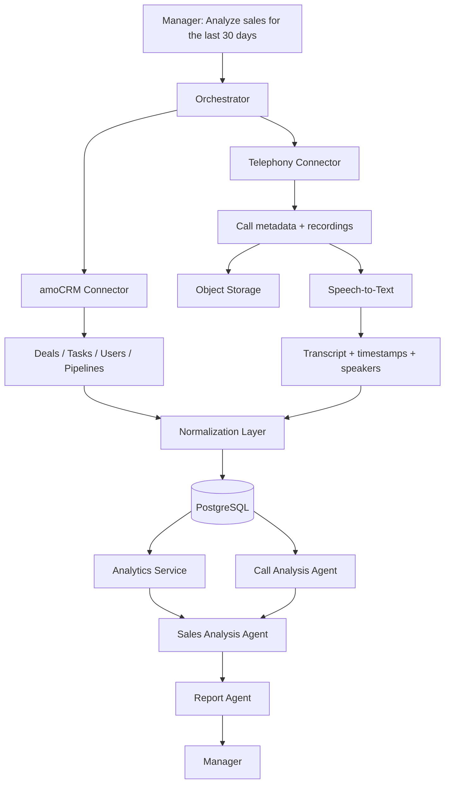

# CityCar — AI Sales Analysis Test

Test assignment for the **AI Operator / AI Agent** position.

## 1. Solution architecture

I would avoid turning every API call into a separate LLM agent. Data collection and KPI calculation should stay deterministic; agents are useful where interpretation, summarization, and cross-source reasoning are needed.



### Components

**Orchestrator**

Receives the manager's request, resolves the period, starts the required data pipelines, waits for results, and coordinates the final report. It should not calculate business metrics itself.

**amoCRM Connector**

Uses amoCRM API v4 with OAuth 2.0 and retrieves:

- deals (`GET /api/v4/leads`);
- tasks (`GET /api/v4/tasks`);
- responsible users;
- pipelines/statuses when required.

For task-quality checks, amoCRM exposes `closest_task_at` on a lead. The Tasks API also exposes `complete_till`, `is_completed`, `entity_id`, and `entity_type`.

**Telephony Connector**

The exact implementation depends on the telephony provider. The adapter should normalize provider-specific data into one internal model:

- call ID;
- manager / extension;
- client phone;
- direction;
- started time;
- duration;
- recording URL or file.

Audio files go to S3-compatible object storage; PostgreSQL stores metadata and object references rather than binary recordings.

### Call processing

```text
Recording
  ↓
Speech-to-Text
  ↓
Transcript + timestamps + speakers
  ↓
Call Analysis Agent
  ↓
Validated structured result
```

Example result:

```json
{
  "client_intent": "interested",
  "objections": ["price"],
  "next_step": "send_offer",
  "follow_up_promised": true,
  "risk": "medium",
  "confidence": 0.88
}
```

I would validate LLM output against a schema rather than relying on free-form text.

### Analytics

Deterministic code calculates:

- new / won / lost deals;
- conversion by manager and pipeline stage;
- deal value;
- deals without the next task;
- overdue tasks;
- call count and duration;
- response/follow-up metrics.

The **Sales Analysis Agent** receives the calculated metrics plus structured call-analysis results and searches for patterns.

### Storage

**PostgreSQL**

- normalized CRM snapshot;
- call metadata;
- transcripts;
- extracted call features;
- calculated metrics;
- generated reports;
- analysis run metadata.

**Object Storage**

- call recordings.

If semantic search over historical calls becomes useful, I would add embeddings and `pgvector` for transcript chunks.

### Production execution

For long-running analysis I would use background jobs instead of holding one HTTP request open:

```text
API request
  ↓
create analysis_run
  ↓
queue jobs
  ↓
CRM + calls + STT + analysis
  ↓
report ready
  ↓
notification / dashboard
```

This makes retries, partial failures, rate limits, and observability easier to handle.

---

## 2. Automation vs human control

### What the system can do automatically

- fetch and normalize CRM/telephony data;
- transcribe calls;
- calculate deterministic KPIs;
- find deals without tasks or with overdue tasks;
- classify calls and extract structured signals;
- detect anomalies;
- prepare a draft report with evidence.

### What should remain human-controlled

- final evaluation of an employee;
- changes to KPI/processes;
- disciplinary or HR decisions;
- disputed low-confidence cases;
- business-critical actions based only on model interpretation.

I would not let an LLM automatically close deals, punish an employee, or change important CRM state only because it interpreted a call in a certain way.

### Three main risks

**1. Incomplete or incorrect source data**

The analysis can be technically correct while the CRM itself is incomplete. I would expose data-completeness indicators in the report.

**2. STT / LLM errors**

Noise, names, numbers, accents, and context can cause transcription or interpretation errors. Important conclusions should contain confidence and references to the underlying transcript/call.

**3. Security and privacy**

CRM data and recordings can contain personal and commercially sensitive information. I would use server-side secrets, RBAC, encryption, audit logs, retention rules, and minimum necessary data transfer to external AI providers.

---

## 3. amoCRM code example

See [`amo-problem-leads.ts`](./amo-problem-leads.ts).

The example retrieves leads updated in the last 30 days and returns leads where:

- `closest_task_at === null` — no next task;
- `closest_task_at < now` — the closest task is overdue.

For deeper task-level analysis I would additionally query `/api/v4/tasks`, because the task model exposes `complete_till`, completion state and entity linkage.

---

## 4. Real AI project

### AI Chatbot Builder / RAG prototype

**Task**

Build a system where a user creates an AI bot, uploads documents, and the bot can use those documents as its knowledge source.

**Stack**

Next.js, React, TypeScript, Supabase/PostgreSQL, `pgvector`, Mistral API, embeddings, document parsing/chunking.

**Implemented**

- authentication;
- bot creation;
- TXT/PDF/DOCX upload;
- document text extraction;
- chunking;
- database schema for documents and chunks;
- vector-storage preparation;
- embedding integration and retrieval pipeline work.

Core pipeline:

```text
Document
  ↓
Parsing
  ↓
Chunking
  ↓
Embeddings
  ↓
Vector storage
  ↓
Similarity retrieval
  ↓
Relevant context
  ↓
LLM
```

The main result was practical experience with document ingestion, chunk boundaries, embedding storage, retrieval, and separating AI integration from application business logic.

This is a prototype rather than a finished production SaaS.

---

## 5. What I learned independently during the last six months

I expanded from frontend-only work toward end-to-end product development.

### React / TypeScript

Applied more complex async/state patterns:

- polling;
- idempotency;
- persistence and refresh recovery;
- optimistic concurrency with `ETag / If-Match`;
- `412` conflict handling;
- stale-result protection.

### Backend

Learned and used:

- NestJS;
- GraphQL;
- Prisma;
- PostgreSQL;
- migrations and seed data.

### Infrastructure

Worked with Docker / Docker Compose, including PostgreSQL health checks and controlled service startup.

### External APIs and analytics

Integrated Telegram Bot API, Apify, Supabase, GA4/GTM and server-side tracking.

### AI

Studied and applied embeddings, chunking, vector search, RAG architecture, structured LLM output and AI-assisted development.

I use AI tools heavily for decomposition, debugging and review, but validate changes through code reading, type checking, lint/build and manual scenarios.

---

## 6. Example of an improvement I proposed and delivered

On a commercial project under NDA I worked on an offers/landing flow.

Instead of relying only on a browser analytics event, I proposed separating **business-critical click tracking** from the client analytics layer.

The resulting flow:

```text
CTA click
  ↓
server endpoint
  ↓
generate unique click_id
  ↓
persist click metadata
  ↓
HTTP 302 redirect
  ↓
target offer
```

GA4/GTM remained a separate client-side analytics layer.

I implemented the server-side tracking path, unique `click_id`, persistence and redirect flow, and verified the end-to-end behavior. This produced an independent server-side record that could be used for attribution and debugging even when client analytics was incomplete.

---

## Notes on implementation choices

- Metrics are calculated by deterministic code; the LLM explains and correlates them.
- AI outputs should be structured and schema-validated.
- Every important AI conclusion should be traceable to source data.
- Long-running work should be queued and retryable.
- Credentials and CRM tokens stay server-side.

## amoCRM references

- Leads API: https://www.amocrm.ru/developers/content/crm_platform/leads-api
- Tasks API: https://www.amocrm.ru/developers/content/crm_platform/tasks-api
- OAuth 2.0: https://www.amocrm.ru/developers/content/oauth/oauth
