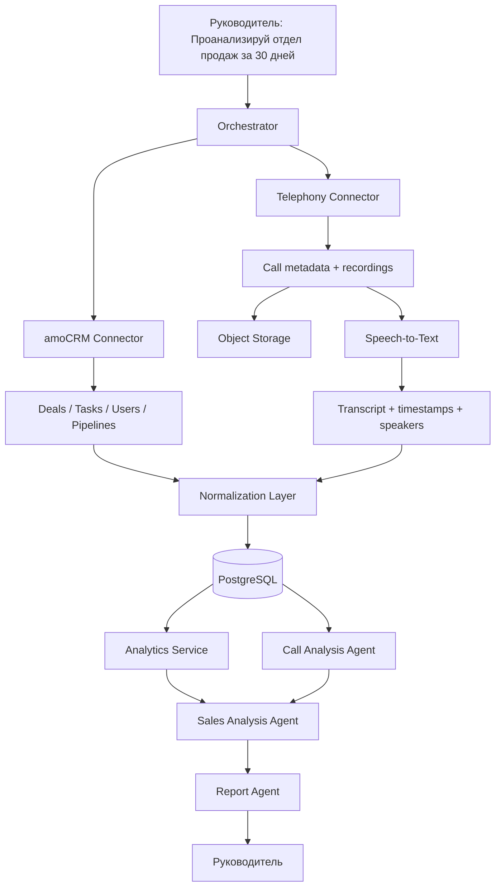

# CityCar — тестовое задание по AI-анализу отдела продаж

Тестовое задание на позицию **AI-оператор / AI-агент**.

## 1. Архитектура решения

Я бы не превращал каждый API-вызов в отдельного LLM-агента. Сбор данных и расчёт KPI лучше оставить детерминированным сервисам, а агентов использовать там, где нужна интерпретация, суммаризация и сопоставление данных из разных источников.



### Orchestrator

Получает запрос руководителя, определяет период анализа, запускает необходимые этапы и координирует формирование итогового отчёта. Сам не должен рассчитывать бизнес-метрики.

### amoCRM Connector

Работает через amoCRM API v4 и OAuth 2.0.

Получает:

- сделки через `GET /api/v4/leads`;
- задачи через `GET /api/v4/tasks`;
- ответственных менеджеров;
- статусы и воронки, если они нужны для анализа.

Для быстрой проверки задач у сделки доступно поле `closest_task_at`. Для более детального анализа задач можно использовать отдельный Tasks API, где доступны `complete_till`, `is_completed`, `entity_id` и `entity_type`.

### Telephony Connector

Реализация зависит от конкретного провайдера телефонии. Коннектор приводит данные к единому внутреннему формату:

- ID звонка;
- менеджер / внутренний номер;
- номер клиента;
- направление звонка;
- дата и время;
- длительность;
- ссылка или файл записи.

Аудиофайлы я бы сохранял в S3-compatible Object Storage, а в PostgreSQL оставлял metadata и ссылки на записи.

### Обработка звонков

```text
Recording
  ↓
Speech-to-Text
  ↓
Transcript + timestamps + speakers
  ↓
Call Analysis Agent
  ↓
Validated structured result
```

Пример результата:

```json
{
  "client_intent": "interested",
  "objections": ["price"],
  "next_step": "send_offer",
  "follow_up_promised": true,
  "risk": "medium",
  "confidence": 0.88
}
```

Ответ LLM я бы валидировал по схеме, а не использовал как свободный текст.

### Аналитика

Детерминированный сервис считает:

- новые / выигранные / проигранные сделки;
- конверсию по менеджерам и этапам;
- сумму сделок;
- сделки без следующей задачи;
- просроченные задачи;
- количество и длительность звонков;
- follow-up / response metrics.

После этого **Sales Analysis Agent** получает уже рассчитанные показатели и структурированный анализ звонков, чтобы искать закономерности и объяснять их.

Например:

> У менеджера высокая активность по звонкам, но значительная часть активных сделок остаётся без следующей задачи. В нескольких звонках был обещан follow-up, которого нет в CRM.

### Хранение

**PostgreSQL**

- нормализованный snapshot CRM;
- metadata звонков;
- transcripts;
- извлечённые признаки звонков;
- рассчитанные метрики;
- отчёты;
- metadata запусков анализа.

**Object Storage**

- записи звонков.

Если понадобится семантический поиск по историческим звонкам, добавил бы embeddings и `pgvector` для transcript chunks.

### Выполнение в production

Для долгого анализа я бы использовал фоновые задачи, а не держал HTTP-запрос открытым:

```text
API request
  ↓
create analysis_run
  ↓
queue jobs
  ↓
CRM + calls + STT + analysis
  ↓
report ready
  ↓
notification / dashboard
```

Так проще обрабатывать retries, частичные ошибки, rate limits и observability.

---

## 2. Что система делает сама, а что передаёт человеку

### Что можно автоматизировать

Система самостоятельно:

- получает и нормализует данные из CRM и телефонии;
- транскрибирует звонки;
- считает KPI;
- находит сделки без задач и с просроченными задачами;
- классифицирует звонки и извлекает структурированные признаки;
- ищет аномалии;
- формирует черновик отчёта с подтверждающими данными.

### Что оставил бы человеку

- финальную оценку работы сотрудника;
- изменение KPI и процессов;
- кадровые и дисциплинарные решения;
- спорные кейсы с низкой уверенностью модели;
- бизнес-критичные действия, основанные только на интерпретации LLM.

Я бы не позволял AI автоматически закрывать сделки, менять важные статусы CRM или принимать кадровые решения только на основании анализа звонка.

### Три главных риска

**1. Неполные или некорректные исходные данные**

CRM может быть заполнена не полностью. Анализ при этом может быть технически корректным, но опираться на плохие данные. Поэтому в отчёте полезно показывать `data completeness`.

**2. Ошибки STT / LLM**

Шум, имена, цифры, акценты и контекст могут привести к ошибкам транскрибации или интерпретации. Для важных выводов нужно хранить confidence и ссылку на исходный transcript/звонок.

**3. Безопасность и privacy**

CRM и записи звонков содержат персональные и коммерчески чувствительные данные. Нужны server-side secrets, RBAC, encryption, audit log, правила хранения данных и минимизация передачи информации внешним AI-провайдерам.

---

## 3. Пример кода для amoCRM

Код находится в [`amo-problem-leads.ts`](./amo-problem-leads.ts).

Он получает сделки, обновлённые за последние 30 дней, и возвращает те, где:

- `closest_task_at === null` — следующей задачи нет;
- `closest_task_at < now` — ближайшая задача просрочена.

Для более глубокого анализа можно дополнительно получать задачи через `/api/v4/tasks`.

---

## 4. Реальный AI-проект

### AI Chatbot Builder / RAG prototype

**Задача**

Сделать систему, в которой пользователь создаёт AI-бота, загружает документы, а бот использует эти документы как источник знаний.

**Стек**

Next.js, React, TypeScript, Supabase/PostgreSQL, `pgvector`, Mistral API, embeddings, parsing/chunking документов.

**Что реализовал**

- авторизацию;
- создание ботов;
- загрузку TXT/PDF/DOCX;
- извлечение текста;
- chunking;
- структуру хранения документов и chunks;
- подготовку vector storage;
- интеграцию embeddings и retrieval pipeline.

Основной pipeline:

```text
Document
  ↓
Parsing
  ↓
Chunking
  ↓
Embeddings
  ↓
Vector storage
  ↓
Similarity retrieval
  ↓
Relevant context
  ↓
LLM
```

Главный результат для меня — практическое понимание архитектуры AI-функций: ingestion документов, chunk boundaries, embedding storage, retrieval и отделение AI-интеграции от остальной бизнес-логики.

Это прототип, а не завершённый production SaaS.

---

## 5. Чему я самостоятельно научился за последние полгода

За последние полгода я заметно расширил стек от frontend-разработки в сторону полноценной разработки продукта.

### React / TypeScript

Применял более сложные async/state сценарии:

- polling;
- idempotency;
- persistence и восстановление после refresh;
- optimistic concurrency через `ETag / If-Match`;
- обработку `412` conflicts;
- защиту от stale results.

### Backend

Самостоятельно изучил и применил:

- NestJS;
- GraphQL;
- Prisma;
- PostgreSQL;
- migrations и seed data.

### Infrastructure

Работал с Docker / Docker Compose, включая PostgreSQL healthcheck и контролируемый порядок запуска сервисов.

### External APIs и analytics

Интегрировал Telegram Bot API, Apify, Supabase, GA4/GTM и server-side tracking.

### AI

Изучал и применял embeddings, chunking, vector search, RAG architecture, structured LLM output и AI-assisted development.

AI-инструменты использую для декомпозиции, debugging и review, но проверяю изменения через чтение кода, typecheck, lint/build и ручные сценарии.

---

## 6. Пример улучшения, которое я предложил и довёл до результата

На коммерческом проекте под NDA я работал над offers/landing flow.

Я предложил не ограничиваться только браузерным событием аналитики, а отделить **business-critical click tracking** от client analytics.

Получился flow:

```text
CTA click
  ↓
server endpoint
  ↓
generate unique click_id
  ↓
persist click metadata
  ↓
HTTP 302 redirect
  ↓
target offer
```

GA4/GTM остались отдельным client-side слоем аналитики.

Я реализовал server-side tracking path, генерацию `click_id`, сохранение данных и redirect flow, после чего проверил end-to-end поведение.

В результате появился независимый server-side след клика, который можно использовать для attribution и debugging даже если client analytics отработала неполно.

---

## Почему я выбрал такой подход

- KPI считаются обычным кодом, а LLM объясняет и сопоставляет результаты.
- AI-ответы должны быть структурированы и валидироваться по схеме.
- Важные выводы должны быть прослеживаемы до исходных данных.
- Долгие операции должны выполняться через очередь и поддерживать retries.
- CRM credentials и tokens должны храниться только server-side.

## amoCRM references

- Leads API: https://www.amocrm.ru/developers/content/crm_platform/leads-api
- Tasks API: https://www.amocrm.ru/developers/content/crm_platform/tasks-api
- OAuth 2.0: https://www.amocrm.ru/developers/content/oauth/oauth
